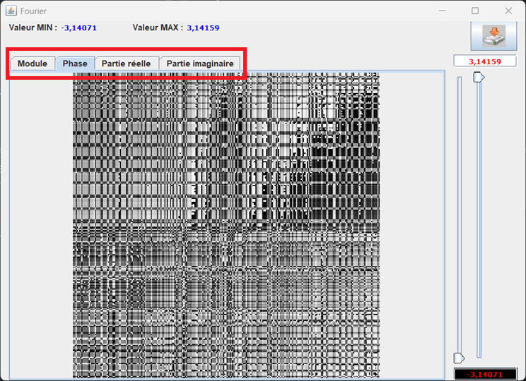
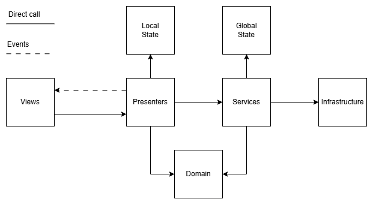

# Projet TDS MASI 4
---
# Ce qui a changé

## Fonctionnalité
Certaines fonctionnalités ont été déplacées ou légérement adaptée afin de les rendre 
plus facile à prendre en main

---

### Réorganisation des menus
Certains items du menu tels que le chargement et la création des image, 
les fonctionnalités de dessin et l'affichage des transformées de Fourier ont été rémaniés.
---

### Chargement et création des images
Désormais les images sont automatiquement chargée en format RGB. 
Leur réprésentation en niveaux de gris est gardée en mémoire à chaque 
modification de l'image et peut-être utilisée dès que nécessaire.

#### Exemple 
```java
//Crée une image blanche de 512 pixels par 512 pixels
Image image = new Image(255,255,255, 512,512);

//Crée une copie de l'image en récupérant son équivalent en niveaus de gris
GrayScaleMatrix = image.toGrayScale();
```

---

### Affichage des transformées de fourier

Le module, la phase, la partie réelle et la partie imaginaire sont maintenant 
régroupés dans une seule et même fenêtre. L'affichage des transformées de plusieurs 
images différentes à travers différentes fenêtres reste possible.


---

## Architecture
C'est ici que la majorité des changements ont eus lieu. 
Une architecture et des patterns modernes ont remplacé la majorité 
de la base de code précédente. 

### MVP
Le programme utilise maintenant un design pattern architectural 
Model-View-Presenter afin de séparer au mieux les responsabilités 
des différentes couches et d'imposer un flux d'éxecution strict 
tel que décrit comme suit :

- View : Réceptionne les événements utilisateur et gère l'état visuel de la fenêtre
- Presenter : Couche d'orchestration entre la vue et la logique métier. Possède un accès aux données locales à la vue courante.
- Services : Couche tampons faisant le lien entre les presenters, l'infrastructure et la couche domaine. Possède un accès à l'état global de l'application
- Domaine : Contient la logique métier de l'application. Doit rester totalement agnostique de toute dépendance technologique
- Infrastructure : Couche contenant un accès à des ressources externes telles que le système de fichier de la machine hôte


### Gestion d'état
La gestion d'état a été remaniée. Plusieurs composants d'état sont maintenant disponabible  dans le package *app.state* :
- Classe abstraite *State* : Classe parent donnant une structure à chaque classe d'état
- Etat global du programme : Représenté par la classe *AppState*. Cet classe est déclarée comme étant un singleton dans le conteneur Guava
- Etat local d'une vue : Representé par toutes les autres classes disponibles dans le package. Ne devrait pas être un singleton

### Injection de dépendances
Le programme utilise maintenant le conteneur d'injection de dépendance de Google, Guava.
Cet ajout permet d'isoler la logique d'instanciation des différents composants lors de l'éxecution. 
La logique de navigation entre les différentes fenêtres s'en retrouve facilitée.
Toutes les dépendances sont enregistrées dans la classe *AppModule* au sein du package *app*

### Logique de navigation
L'injection de dépendance précédement expliquée a permis d'isoler la logique de navigation.
Désormais, pour naviguer entre différentes vue, il suffit de créer une méthode au sein de 
la classe SwingNavigator, d'injecter l'interface INavigator dans une Presenter et d'appeler la méthode nouvellement créée.

Un exemple de fonctionnement est déjà fourni dans la classe SwingNavigator et peut-être facilement retracé en trouvant
les usages de la méthode *showFourier()* avec un IDE moderne.

#### Note importante
Toutes les vues doivent être enregistrée en tant que dépendance au sein du conteneur Guava. 
Pour ce faire, différents exemples sont déjà implémenté dans la classe *AppModule*. 
Cet ajout aura pour conséquence de donner accès à un objet ``Provider<T>`` (où T est le type de la dépendance enregistrée)
qui pourra être injecté dans la classe SwingNavigator.

Appeler la méthode ``Provider<T>.get()`` aura pour conséquence d'instancier la dépendance désirée, dans notre cas, 
une potentielle vue qui pourra ensuite être affichée.
